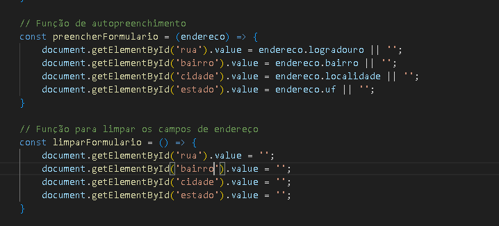

## Projeto de Cadastro completo

Nesse projeto foi feito de certa forma um compilado de projetos antigos como projetos de tela de login, validação de CEP, CPF e Email. 
Porém mesmo sendo um projeto que a primeiro modo pareça fácil não é. Então por meio desse projeto de cadastro, irei catalogar e dizer todos os pontos e ferramentas utilizados para a criação desta tela.

 

**índice**

* [Tecnologias_utilizadas](#tecnologias-utilizadas)
* [Referências](#referencias)
* [Informações](#informações)
* [HTML](#html)
* [CSS](#css)
* [Javascript](#javascript)
* [Recursos](#recursos)
* [Autores](#autores)

## Tecnologias utilizadas:

* [<code></code>](https://developer.mozilla.org/pt-BR/docs/Web/HTML)
* [<code></code>](https://developer.mozilla.org/pt-BR/docs/Web/CSS)
* [<code></code>](https://github.com/)
* [<code></code>](https://git-scm.com/)
* [<code></code>](https://code.visualstudio.com/)
* [<code></code>](https://fontawesome.com/versions)
* [<code></code>](https://fontawesome.com/versions)
* [<code></code>](https://fonts.google.com/)
* [<code></code>](https://sweetalert2.github.io)

## Referencias:

* [Validacao-tel-de-log](https://github.com/Fell1pe/Validacao-tel-de-log)
* [form-CadEndereco](https://github.com/Fell1pe/form-CadEndereco)
* [Validações](https://github.com/Fell1pe/validacoes)
* [Vídeo de referência](https://www.youtube.com/watch?v=qKWApkuhNu8)

## Informações:

### HTML:

* Nessa parte do processo foi criada a estrutura do HTML de maneira até que simples porém bem executada criando um container que é utulizado para escrever todo o formulário de cadastro.
Cada input separado por id e nomeclatura distintos, também fazendo a separação da parte de cadastro pessoal e endereço por meio do código fieldset e legend. 
toda a aplicação do HTML está documentada linha a linha no código, caso tenha maior interesse em velo detalhadamente clique [aqui](https://github.com/Fell1pe/form-cadastro-completo/blob/main/index.html).

### CSS:

* Nesse arquivo está a estrutura da estilização do site também como no item acima caso tenha maior interesse sobre o arquivo clique [aqui](https://github.com/Fell1pe/form-cadastro-completo/blob/main/style.css), nesse arquivo está com uma documentação mais pesada sobre atributos utilizados. Também contendo a "criação" de uma animação por meio de características do CSS e variação de cores pré definidas no arquivo.

### JavaScript:

* Agora vamos falar sobre a "principal" parte desse projeto. O javascript utilizado aqui é um pouco mais complexo de explicar mais iremos dizer passo a passo dele aqui, mais caso queira ver aqui apenas o arquivo clique [aqui](https://github.com/Fell1pe/form-cadastro-completo/blob/main/script.js).

 

### modo escuro:

* Nessa primeira etapa do código foi feita a criação da troca de modo escuro.
    * primeiramente é criado um document que adiciona um evento onde puxa uma variável chamada (DOMContentLoaded) que carrega esse evento logo após o carregamento do HTML sem aguardar ele passar pelo CSS. 
    * cria-se duas constantes puxando-as pelo id presente no HTML sendo eles login_form e mode_icon.
    * Agora sim é criado um novo evento para alternar entre os modos claro e escuro, a partir da ação de click. Dentro da função e criado um if que se fa-moon for um token verdadeiro ele removera fa-moon e adicionará fa-sun e dark.
    Caso contrario ele ira retornar um else que remove fa-sun e dark e adiciona fa-moon.

 

### todas as const:

* Nessa parte do processo foi criada todas as const utilizadas posteriormente no projeto, todas sendo usados os IDS do HTML.

 

### verifica campos:

* Agora é adicionado outro evento dessa vez ao loginForm que é executado apenas quando for enviado, esse evnto é chamado de evento.
    * Agora já dentro desse evento foi criado uma const chamada requiredFields ou campos obrigatórios onde ela puxa todas as consts anteriores menos complento.
    * logo após é criado um for ou um loop que cria um let(variável que não contem valor fixo mais pode ser alterado com o tempo), que diz que field ou campos sera constantemente atibuido a requiredFeields.
### if:

* Nesse momento é criado uma atribuição que diz que field tem um valor qualquer(trim(any)) que é igual a 0. puxando o evento de acima adicionando um caracteristica chamada *preventDefalt* que possibilita que o if possa ser cancelado sem atrapalhar o processo dos demais atributos do código. Caso esse evento acontessa é mostrado um alert que diz para o usuário preencher os campos obrigatórios. Após adicionando um foco a field e dando um return para que a página não seja astualizada com as informações erradas e possa dar continuidade ao código e ao site.

 

### if_Email:

* Nesse segundo if é feita a verificação do Email puxando a function checarEmail dizendo que esse valor será atribuido a const emailInput que puxa o id do campo email.
    Dentro do if novamente é puxado o event de LoginForm e adicionado a caracteristica *preventDefalt*, após isso insere um return para impedir o envio do formulário caso o email seja inválido.

 

### if_CPF: 

* Agora neste terceito if é feita a verificação de CPF puxando a function validarCPF dizendo também que esse valor será atribuido ao campo CPFInput que puxa o if CPF e é adicionado um value para pegar o valor do campo.
    Após isso é inserido novamente event e atribuido ao próprio um *preventDefault*, em seguida é criado um "alert" que é na verdade uma extenção via [API](https://sweetalert2.github.io) que faz com que possa utilizar de alerts estilizados dentro do código, nesse exemplo é mostrado um icone de erro com titulo e texto informando ao usuário que o CPF é inválido.
    Novamente por fim é adicionado um foco ao campo de CPFinput.

 

### validação de CPF:

* Nessa parte do código é criada uma function para a validação de CPF atribuindo um sub nome de cpf para a mesma.
    * Nessa primeira parte o código remove caracteres não numéricos, dizendo que cpf = cpf.**replice** que dira que esse valor é uma *string* após isso usando regex para remover os caracteres não numéricos dessa string.

    #### if: 

    * nesse if é criada uma expressão regular para verificar se cpf tem 11 dígitos também usando regex para verificar se todos os dígitos não são iguais, caso esses dois verificadores estejam corretos o código retornará false.

    Após isso é criado dois let sendo eles **soma** e **resto**

    #### primeira validação:

    * cria-se um for(loop) onde é dito que let equivale a i que tem valor 1, se i for menor ou igual a 9 i será adicionado mais um número.

    Dentro desse for agora é dito que let soma += *parseInt*(diz que o valor da string  agora é um inteiro) junto a essa função é dito que cpf.*substring*(recolhe os valores iniciais e finais da string), resumidamente esta parte do código ira pegar os primeiros 9 digitos do CPF e verificar 1 por 1 a partir de i sendo valor 10 inicialmente e decrecendo no decorrer do CPF.
    * Como exemplo vamos utilizar o CPF 12345678909:

            i= 1: 1 * 10 = 10
            i= 2: 2 * 9 = 18
            i= 3: 3 * 8 = 24
            i= 4: 4 * 7 = 28
            i= 5: 5 * 6 = 30
            i= 6: 6 * 5 = 30
            i= 7: 7 * 4 = 28
            i= 8: 8 * 3 = 24
            i= 9: 9 * 2 = 18
            soma total: 10 + 18 + 24 + 28 + 30 + 30 + 28 + 24 + 18 = 210

* agora é calculado o resto da seguinte maneira: soma(210) * 10 % 11
        Exemplo: 

         resto = (210 * 10) % 11 = 2100 % 11 = 2100 - (190 * 11) = 2100 - 2090 = 10

* apos todo esse calculo o caso o resto seja igua a 10 ou 11 o número de resto é igual a 0

#### segundo dígito verificador:

* agora ira verificar o número 11 do CPF da mesma maneira que foi feita a verificação do 10 digito sera com este. 
Porém dessa vez iremos começar a partir do número 11, veja o exemplo a seguir utilizando o mesmo CPF dito anteriormente:

        i=1: 1 * 11 = 11
        i=2: 2 * 10 = 20
        i=3: 3 * 9  = 27
        i=4: 4 * 8  = 32
        i=5: 5 * 7  = 35
        i=6: 6 * 6  = 36
        i=7: 7 * 5  = 35
        i=8: 8 * 4  = 32
        i=9: 9 * 3  = 27
        i=10: 0 * 2 = 0
        Soma total: 11 + 20 + 27 + 32 + 35 + 36 + 35 + 32 + 27 + 0 = 255

* e novamente é feito o calculo do resto dessa equação sendo o resto = a soma(255) * 10 % 11.

        resto = (255 * 10) % 11 = 2550 % 11 = 2550 - (231 * 11) = 2550 - 2541 = 9

* novamente se o resultado dessa equação for 10 ou 11 o número sera lido como valor 0, que não é o caso do nosso exemplo onde o número irá se manter sendo 9.
* após todos esses verificadores o código retorna false caso o CFP esteja errado.

### Verica e-mail:

* primeiramente é criado uma function checarEmail puxando a const emailInput que puxa o id email. Dentro dessa function é criada uma constante que cria um regex para ver se o email esta nos paasadrões do email como o uso de @ e .

* após isso é verificado se o email está vazio ou em um formato inválido. Abre um if que puxa a const criada anteriormente adicionando um test que será utilizado dentro da const emailValue, dentro desse if é usado novamente o alert estilizado com icone de informação, tituo e texto para informar email válido.
    * após é inserido um foco ao campo de email, caso toddas as informações desse if estejam erradas o campo retornará false.

     

### verifica CEP:

 

* primeiramente é criado uma const para que seja feito o preenchimento automatico do formulário, criando a const adicionando um nome a mesma e aedicionando o id de todos os campos que serão preenchidos pelo cep adicionando um valor a eles que seja correspondente ao nome utilizado dentro da API.

* segundamente é criado outra const dessa vez para limpar o formulário que por sua vez puxa o id dos campos preenchidos pelo cep e da um valor a eles de nada('').

 
 

* primeiramente é criado uma verificação com regex para ver se o CEP contem 8 números e se apenas há numeros no CEP. 

* Após isso é criado um if para que usa de cepValido para cria-lá, dentro desse if é utilizado a cosnt limparFormulário e cria uma const com a url do [API](https://viacep.com.br).

    * é criado uma const address(endereço) que pega as informações do CEP na URL.

    * após esses passos é criado diversas variaveis para que seja comunicado os possíveis erros ao buscar o CEP do usuário, todos utilizando as mensagens de erro de sweetalert2 que se forem verdadeiros iram retornar a mensagem de erro e a const limparFormulario mas caso esses erros como address.erro não serem verdadeiros o código retornará a const preencher formulário utilizando a const address.

* Por fim é criado um observador de evento ue ao deixar o campo executa a função de preencher o CEP assim fazendo o autopreenchimento.

## Recursos:

* Documentação HTML5: [https://developer.mozilla.org/pt-BR/docs/Web/HTML](https://developer.mozilla.org/pt-BR/docs/Web/HTML)
* Documentação CSS3: [https://developer.mozilla.org/pt-BR/docs/Web/CSS](https://developer.mozilla.org/pt-BR/docs/Web/CSS)
* Documentação JavaScript: [https://developer.mozilla.org/pt-BR/docs/Web/JavaScript](https://developer.mozilla.org/pt-BR/docs/Web/JavaScript)

**Linkedin**

[publicação do projeto no linkedin](https://www.linkedin.com/posts/fellipe-zanin-1b1a7728b_nesta-publica%C3%A7%C3%A3o-venho-falar-sobre-uma-atividade-activity-7251046230078746624-sPZo?utm_source=share&utm_medium=member_desktop)

## Autores
| [ Fellipe Gabriel Zanin](https://github.com/Fell1pe) |